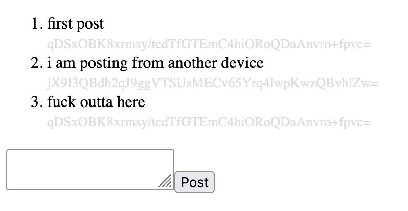

# example-app

## What?

This repo demonstrates the usage of the other useless libraries I posted in order to make a whole useless app.

Currently, it:

 1. Uses [`incomponent`](https://github.com/stevvvns/incomponent) to make some webcomponents.
 2. Uses [`koa-wsapi`](https://github.com/stevvvns/koa-wsapi) to make some websocket RPC calls.

Combined, these two make for a trivial little message board app where each client gets a unique random identifier, lucky them.

## Why?

Just to document how the libraries work, and prove to myself that they do work to some nominal standard.

## How?

You need to have Redis running.

Clone this and `$ npm start` to run the app, for whatever good that does.

